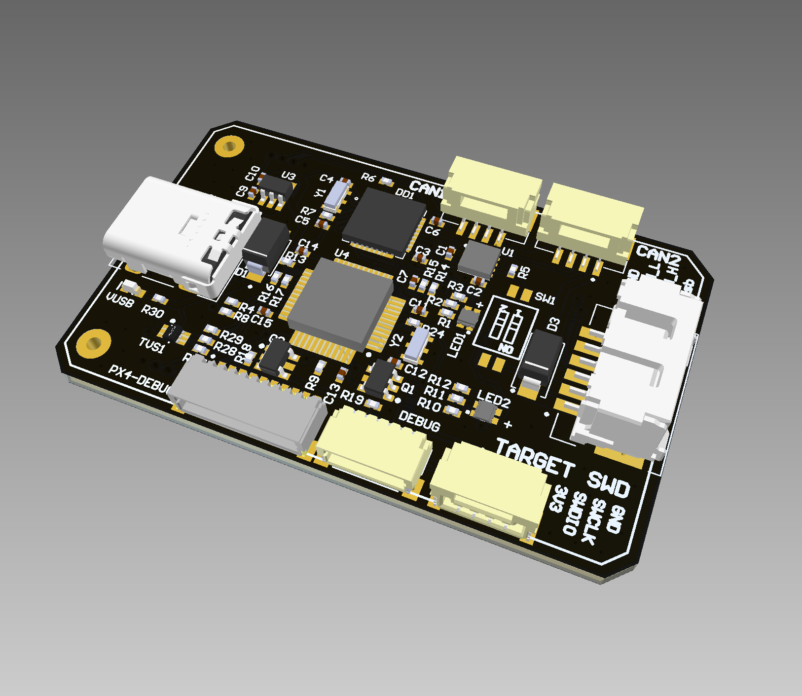

# Cyphal and DroneCAN Sniffer and Programmer

## Mechanical Specification

## Order from PCBWay

You can order this PCB by this link https://www.pcbway.com/project/shareproject/ST_Link_programmer_and_UAVCAN_sniffer.html

## Order details

### PCB Specification Selection

- Board type : Panel by PCBWay
- Break-away rail: Yes
- Instructions:
~~~
None
~~~
- Route Process: Panel as PCBWay prefer
- X-out Allowance in Panel:  Accept

- Size (single): 31.9 x 51.9 mm
- Quantity (single): 50
- Layers: 2

- Material: FR-4
- FR4-TG: TG 150-160
- Thickness: 1.6
- Min Track/Spacing: 6/6mil (0.17 mm)
- Min Hole Size: 0.3 mm
- Solder Mask: Black
- Silkscreen: White
- Edge connector: No
- Surface Finish: HASL with lead
- Yes - Tick means you accept we might change "HASL" to "ENIG" at our discretion without extra charge.
- Via Process: Tenting vias
- Finished Copper: 1 oz Cu
- Other Special request:
~~~
None
~~~

### Assembly Service

- Turnkey
- Board type : Panelized PCBs
-  Assembly Side(s): Both sides
- Quantity: 50
- Contains Sensitive components/parts - No; 
- Do you accept alternatives/substitutes made in China? - Yes

- Number of Unique Parts: 22
- Number of SMD Parts: 51
- Number of BGA/QFP Parts: 0 
- Number of Through-Hole Parts: 1

### Additional Options

- Firmware loading: Yes
- Detailed information of assembly:
~~~
Firmware is in attachements.
Take a look at the picure in attachements PWM1, PWM2 should be installed from the side.
~~~

## Device and Documentation Support

- [User manual](https://raccoonlabdev.github.io/docs/guide/programmer_sniffer/)
- [Hardware docs](doc/doc.pdf)

## Device Support

- [Firmware sources](https://github.com/RaccoonlabDev/node)
- [Firmware binary](https://github.com/RaccoonLabHardware/SNIFFER/tree/v1.3/firmware)

## TERMS OF USAGE / LICENCE

The material provided in this Github repository is subject to the following conditions. 

Firmware files: All firmwares are free (but not open source). Besides unlimited private use you are also granted the permission to use them for commercial purposes under the condition that (1) you don’t modify the firmware, e.g. remove or change copyright statements, (2) provide it for free, i.e. don’t charge any explicit or implicit fees to your customers, and (3) correctly and clearly cite the origin of the firmware and the project web page in any product documentation or web page. 

Hardware files: All hardware, for which material is provided, is open source hardware, under the terms of the TAPR Open Hardware License as published by the Free Hardware Foundation, see http://www.tapr.org/ohl.html. The TAPR license explicitly permits essentially unlimited commercial use, with only few conditions such as that copyright logos are not removed.